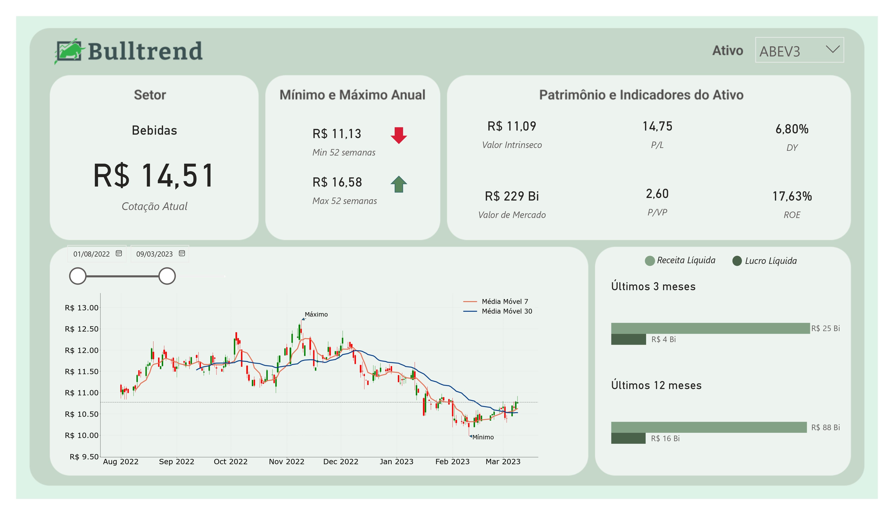

# Bulltrend | Dashboard de Análise de Ações

Em um mercado com excesso de dados, o desafio não é acessar informação — é transformá-la em decisão.

Este projeto consolida dados do mercado financeiro em uma visão clara e direcionada, combinando indicadores de desempenho com a leitura visual da cotação por meio de gráfico candlestick.

## Insight
A análise evidencia a relação entre preço de mercado e valor percebido do ativo, enquanto o gráfico candlestick permite identificar tendências, reversões e pontos relevantes de entrada e saída.

## Objetivo
Transformar dados dispersos em uma narrativa visual simples, objetiva e acionável para análise de ações.

## Principais entregas
- Visão consolidada do ativo  
- Métricas de mercado e valuation  
- Análise de desempenho recente  
- Comparação de períodos (3M vs 12M)  
- Visualização da cotação com gráfico candlestick  

## Tecnologias utilizadas
- Power BI para visualização executiva  
- Python para coleta e tratamento de dados  
- Pandas e NumPy para manipulação de dados  
- Matplotlib e Seaborn para apoio analítico  
- Fundamentus e YFinance como fontes de dados  

## Aplicação
Solução voltada para análise de ações com foco em suporte à decisão e monitoramento de performance no mercado financeiro.
